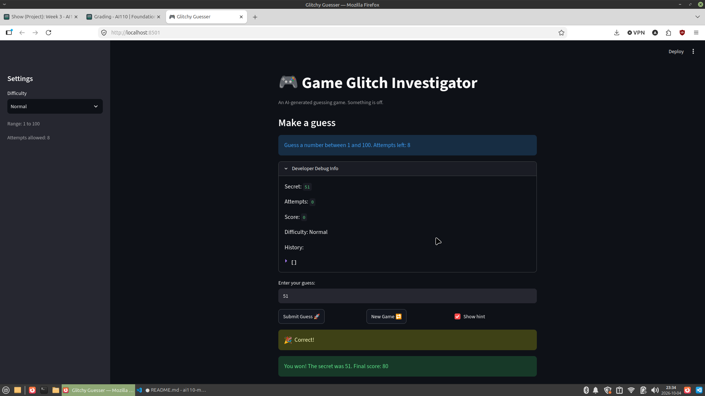

# 🎮 Game Glitch Investigator: The Impossible Guesser

## 🚨 The Situation

You asked an AI to build a simple "Number Guessing Game" using Streamlit.
It wrote the code, ran away, and now the game is unplayable. 

- You can't win.
- The hints lie to you.
- The secret number seems to have commitment issues.

## 🛠️ Setup

1. Install dependencies: `pip install -r requirements.txt`
2. Run the broken app: `python -m streamlit run app.py`

## 🕵️‍♂️ Your Mission

1. **Play the game.** Open the "Developer Debug Info" tab in the app to see the secret number. Try to win.
2. **Find the State Bug.** Why does the secret number change every time you click "Submit"? Ask ChatGPT: *"How do I keep a variable from resetting in Streamlit when I click a button?"*
3. **Fix the Logic.** The hints ("Higher/Lower") are wrong. Fix them.
4. **Refactor & Test.** - Move the logic into `logic_utils.py`.
   - Run `pytest` in your terminal.
   - Keep fixing until all tests pass!

## 📝 Document Your Experience

- [ ] Describe the game's purpose.
   - Game Glitch Investigator is a Streamlit number-guessing game where the player guesses a secret number within a difficulty-based range and attempt limit, receiving "Too High"/"Too Low" hints and a score until they win or run out of attempts.
- [ ] Detail which bugs you found.
   - We (me and Claude) found several bugs: check_guess compared the guess to the secret lexically as strings instead of numerically (causing wrong high/low hints when the secret was a string), the New Game button only reset attempts and secret while leaving score, status, and history stale — which also meant a finished game's leftover status would immediately re-trigger the game-over screen — and update_score applies an inconsistent parity-based bonus/penalty on "Too High" guesses. 
- [ ] Explain what fixes you applied.
   - We fixed the check_guess comparison by coercing secret to int, fixed New Game to reset all five session-state fields using the difficulty-aware range, and changed the initial attempts count from 1 to 0; the update_score parity issue was identified but intentionally left unfixed for now.

## 📸 Demo Walkthrough

Describe your fixed game in numbered steps so a reader can follow along without watching a video:

## Demo Walkthrough
1. User enters a guess of 0.
2. Game returns "📈 Go HIGHER!"
3. User enters a guess of 101, and the game shows "📉 Go LOWER!"
4. Open Developer Debug info and view it.
5. Click New Game button.
6. Check if all fields other than secret are cleared.
7. Enter the secret number and hit the Submit Guess button.
8. Game should return 🎉 Correct! and on a new line, "You won! The secret was ___. Final score: ___.

**Demo Screenshot**: 
 <!-- Insert a screenshot of your fixed, winning game here -->

## 🧪 Test Results

```
tests/test_game_logic.py::test_winning_guess PASSED                      [ 20%]
tests/test_game_logic.py::test_guess_too_high PASSED                     [ 40%]
tests/test_game_logic.py::test_guess_too_low PASSED                      [ 60%]
tests/test_game_logic.py::test_guess_too_high_with_string_secret PASSED  [ 80%]
tests/test_game_logic.py::test_guess_too_low_with_string_secret PASSED   [100%]

============================== 5 passed in 0.01s ===============================
```

## 🚀 Stretch Features

- [ ] N/A
